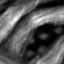

# Distributed Defect Classification

## Big Data and Analytics project at UniBO

The aim of this project is to explore and analyze a dataset and perform different machine learning task on top of an Apache Spark cluster built using Docker with a Jupyter Lab interface.

## Task and Dataset

The purpose of this project is to investigate how the different components of a Spark + Hadoop distributed environment interact in a distributed image classification task. We want to correctly assign 'good' or 'defect' labels to collected images of textile patches.

The dataset is public on Kaggle. It has multiple formats: we choose to use the 72.000 images, 64x64 resolution h5 file. It contains 6 defect classes (color, good, cut, hole, metal contamination, thread), each having 12.000 images, but we are going to put all the defective classes together, ending up with 50.000 defective pictures in the class 'defect' and 12.000 images in the 'good' class (no defect).

## Samples from the 'Good' class

## Samples from the 'Defect' class

## Methods

We make use of the following classification methods:

- ASJ (Approximate Similarity Join) (Supervised)
- K-Means & Bisecting K-Means (Unsupervised)

